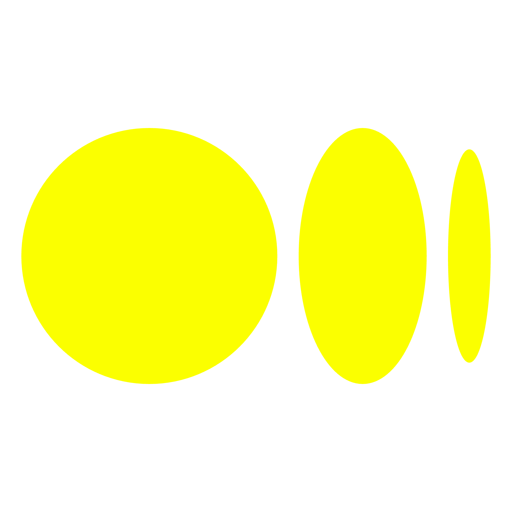
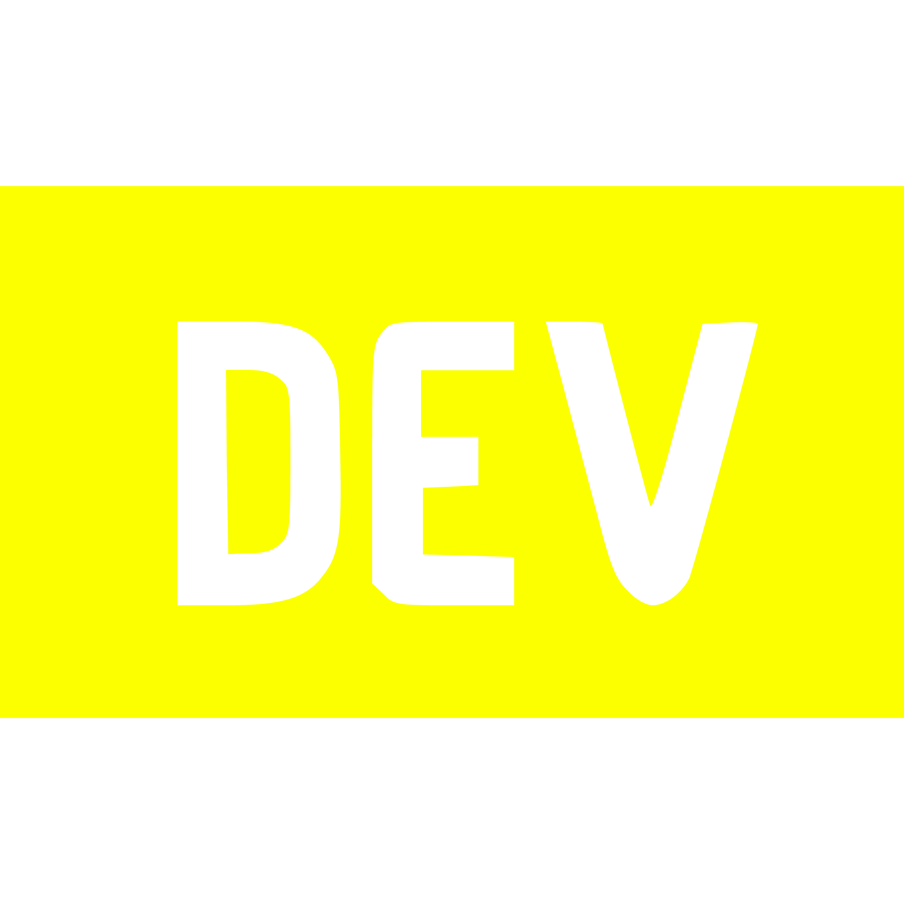

## Welcome to My GitHub Portfolio

Hello and welcome to my GitHub page! I'm Mihir, a passionate developer and technology enthusiast with a focus on hands-on learning and project-based approaches. This repository serves as a comprehensive showcase of the diverse range of projects I have performed throughout my journey of becoming a senior software developer.

### What You'll Find Here

On this page, you'll discover projects that span across various domains, including:

- **Frontend Development:** Cutting-edge projects using React, Next.js, and other modern frameworks.
- **Backend Development:** Robust backend solutions with FastAPI, Flask, Django, and more.
- **DevOps:** Efficient CI/CD pipelines, containerization with Docker and Kubernetes, and cloud resource management.
- **Full-Stack Development:** Seamless integration of frontend and backend technologies.
- **Data Engineering:** ETL pipelines, data manipulation, and storage solutions.
- **Data Science:** Insightful data analysis and visualization projects.
- **Machine Learning & AI:** Practical applications of machine learning algorithms and AI models.
- **System Design:** Scalable and maintainable system architectures.
- **Best Practices:** Code quality improvements, refactoring, and optimization techniques.
- **Data Structures & Algorithms:** Fundamental and advanced algorithm implementations.

### Connect With Me

Feel free to explore the projects, watch the corresponding videos on my YouTube channel, and read my blogs on Medium or DevTo. You can also connect with me on LinkedIn and Instagram profiles and visit my website for more insights into my work and collaborations, you can also send me an email.

&nbsp;&nbsp;
&nbsp;&nbsp;
&nbsp;&nbsp;
&nbsp;&nbsp;
&nbsp;&nbsp;
&nbsp;&nbsp;
&nbsp;&nbsp;

Thank you for visiting, and happy coding!
