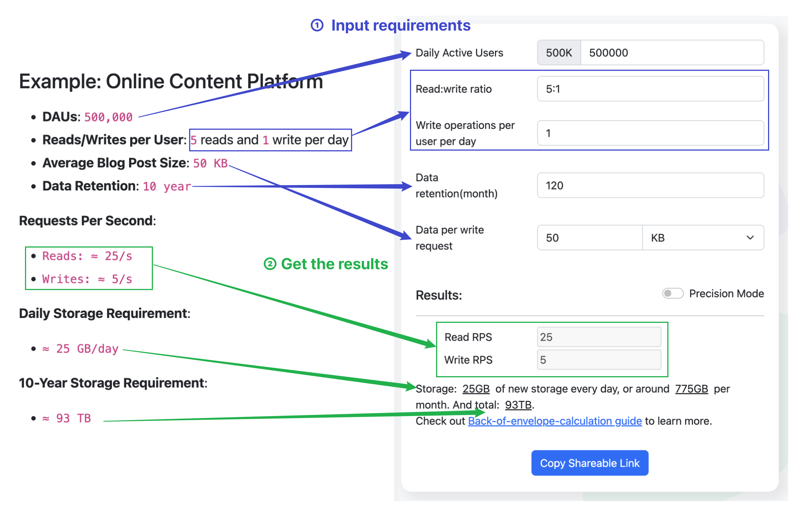

# Back-of-the-envelope Resource Estimation

Estimating resources for system design involves understanding the load parameters like daily active users (DAU) and translating them into computing and storage needs. It's crucial for identifying performance bottlenecks and designing scalable systems.

## Key Load Parameters

**Daily Active Users (DAU)**: Translates to requests per second for engineering calculations.

**Requests Per Second**: Helps estimate database and cache size requirements.

**Read/Write Ratio**: Influences the design of read and write paths, affecting decisions on caching, replication, and data store selection.

**Concurrent Connections**: Critical for applications like chat services, requiring strategies for managing web socket connections.

## Estimating Storage and Performance

### Design Considerations Based on Load

- **High Read/Write Ratio**: Implement caching and replication for efficient read operations.
- **High Write/Read Ratio**: Optimize for write operations using high-throughput data stores and eventual consistency.

### Throughput and Latency

- **Throughput**: Measures system capacity to handle data or transactions over time. Essential for assessing system performance.
- **Latency**: Time taken for a request to travel from sender to receiver and back. Critical for real-time applications.

### Response Time

- Includes both latency and server processing time. Key for a smooth user experience across various applications.

### Example: Online Content Platform

- DAUs: `500,000`
- Reads/Writes per User: `5 reads and 1 write per day`
- Average Blog Post Size: `50 KB`
- Data Retention: `10 year`

**Requests Per Second**:

- `Reads: ≈ 25/s`
- `Writes: ≈ 5/s`

**Daily Storage Requirement**:

- `≈ 25 GB/day`

**10-Year Storage Requirement**:

- `≈ 93 TB`

**The usage of Estimator as bellow**:

Additionally, the "Precision Mode" toggle is off by default, using `100,000` seconds per day and data sizes in `1000-byte` units for rough estimates. When enabled, it switches to precise calculations with `86,400` seconds per day and `1024-byte` units for data sizes.

Try yourself to estimate the resources required for your system:

[Resource Estimator](https://systemdesignschool.io/resource-estimator)
