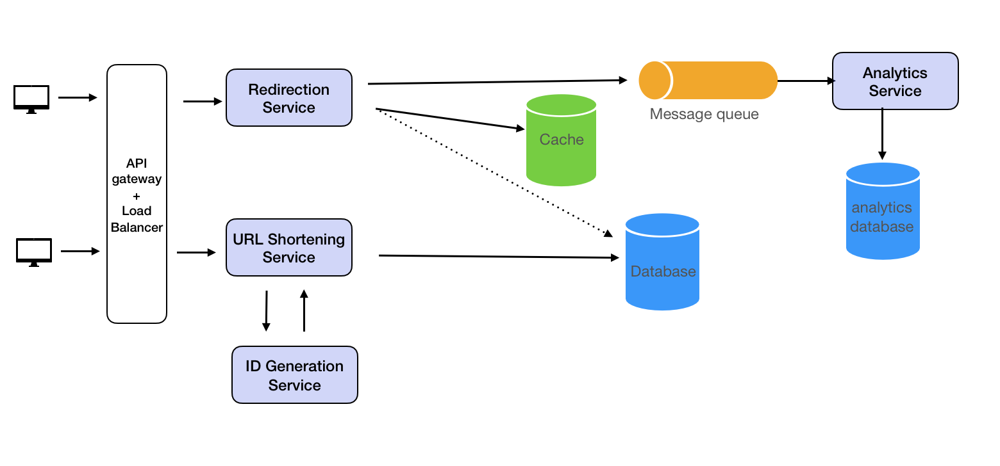

# URL Shortener System Design

## Functional Requirements

URL Shortening: Given a URL, the service should generate a shorter and unique alias of it. This is the core functionality of the service. The shortened URL should be unique across all users. The shortened URL should be as short as possible to save characters using only the English alphabet letters (a-z, A-Z) and digits (0-9).
URL Redirection: If a user accesses a shortened URL, the service should redirect them to the original URL.
Analytics: The service should be able to keep track of the number of times a short link has been accessed.

## Nonfunctional Requirements

Scale requirements:

100M Daily Active Users
Read:write ratio = 100: 1
Data retention for 5 years
Other requirements:

High availability
Low latency
High durability
Security

## Resource Estimation

The read to write ratio is 100:1, and considering a user base of 100 million daily active users, it implies that there are approximately 1 million write requests (URL shortening) and 100 million read requests (URL redirections) per day.

Traffic Estimates: With 1 million URL shortenings daily (write requests), we would have approximately 12 URL shortenings per second. For URL redirections (read requests), at a 100:1 ratio, we would have approximately 1,150 redirections per second.

Storage Estimates: With each user shortening about one URL per day, and only 1 million users creating new URLs daily, we would add 1 million new entries every day. Assuming each entry is about 500 bytes (URLs + metadata), we would need about 500MB of new storage every day, or around 15GB per month.

Bandwidth Estimates: If every write operation has an average size of 500 bytes, and there are 1 million write operations daily, we will have approximately 500MB of incoming data daily. For the read requests, given the 100:1 read to write ratio, there will be 100 million read requests daily. Therefore, the service will serve approximately 50GB of data daily for the read requests.

Memory Estimates for Cache: If we want to cache some of the hot URLs that are frequently accessed, and let's say we want to cache 20% of daily read requests, we would need to cache 20 million URLs. Assuming each URL takes 500 bytes in memory, we would need about 10GB of memory.

Use Resource Estimator to calculate.

## API Design

Our system can expose the following REST APIs:

URL shortening service (Write service)

POST /api/urls/shorten
Request Body:

{
"longUrl": "http://example.com"
}
Response:

{
"shortUrl": "http://urlshort.ly/abcd"
}
Redirection service (Read service)

GET /api/urls/{shortUrl}
Response:

{
"longUrl": "http://example.com"
}
We can optimize the Redirection response by having the server responds with a 302 status code and includes the original long URL in the Location header. The client then automatically requests the original URL specified in the Location header. This makes the process seamless for the user, and they are redirected to the original URL without needing to manually request it

## High-Level Design

Our service can be split into two main paths: the write path for shortening a URL and the read path for redirecting to the original URL.

Design Url Shortener

In both paths, we have an API gateways that handles the protocol translations, request routing, API composition, and other functions and a load balancer that handles scaling web servers. Given that the problem (as in most system design problems) exhibits distinct read and write scalability requirements, it's prudent to approach the design and discussion of these components separately.

Write Path
URL Shortening Service (Write Service): Accepts a long URL from the request and gets a shortened URL from ID Generation Service.
Database: The original URL is stored against this unique key in the database.
URL Shortening Service (Write Service): Responds with the shortened URL.
Read Path
URL Redirection Service (Read Service): Accepts a short URL from the requests and returns the original long URL.
Cache: The cache is checked first to find the corresponding long URL. If it's not in the cache, the request is forwarded to the database.
Database: If not in cache, the original URL is retrieved from the database using the short URL.
URL Redirection Service (Read Service): Respond with the original URL.

## Detailed Design

### How to Generate Short URLs?

One obvious choice is hashing. We can take the long URL and hash it with MD5 and use it as the short URL. However, this wouldn't work in two aspects.

The main functional requirement is that the IDs need to be unique. We cannot have two long URLs that map to the same short URL. There could be hash collisions where a hash function produces the same output for two different input.
MD56's output is 128 bit, or 32 characters. This isn't "short".
To handle the first problem, we could use

Longer Hashes: Use a hash function that produces a larger hash value. This will exponentially increase the number of possible hash values and decrease the likelihood of collisions. For example, using SHA-256 instead of MD5.
Double Hashing: Apply a second hash function when a collision is detected. This requires keeping track of which keys have collided and may require additional storage.
Neither of these is ideal. And the 32 character length makes MD5 unsuitable for short IDs.

Another choice is UUID (Universally Unique Identifiers), which is commonly used as unique IDs in databases like MongoDB. Additionally, UUIDs are designed to be statistically unique. That means while there is a theoretical possibility of collision (two different sources generating the same UUID), the probability is so low that it can be considered negligible for most practical purposes. However, it suffers the same issues - it's also 32 characters, which is a bit too long for our URL "shortener".

### Making Short URLs with Base62 Encoding

The problem asks us to generate URLs as short as possible using English letters and numbers. This strongly suggest base62 encoding. Base62 encoding uses a-z, A-Z, and 0-9 to represent the ID, thereby providing 62 potential characters for each position within the string.

For a base62 encoded string of length n, there are 62^n number of possible choices. For n = 5, 62^n ~=900M which is much greater than the 316M we calculated in the resource estimation section. Therefore a URL made up of base62 encoded string of length 5 should suffice to provide enough unique IDs.

### How Base62 Encoding Works

We start with an integer and keep dividing it by 62 and use the remainder as index into the 62 characters and append it to the result. Here's the python code showing this process.

```python
import string

# Characters for base62 encoding

CHARS = string.ascii_lowercase + string.ascii_uppercase + string.digits

def base62_encode(num):
"""Encodes a number using base62 encoding."""
if num == 0:
return CHARS[0]
encoding = ''
while num > 0:
num, remainder = divmod(num, 62)
encoding = CHARS[remainder] + encoding
return encoding

# Testing the function

print(base62_encode(123456789)) # Output: "8M0kX"
```

Notice that base62 encoding takes an integer as its input. So now the question is how to convert our long URL to an integer.

## Distributed ID Generation Service

A distributed unique ID generator service (or a Key Generation Service (KGS)) can be used to create unique IDs in a distributed system where many nodes or services need to generate unique IDs independently but without collisions. Examples include Twitter's Snowflake and Instagram's ID generation method.

The distributed unique ID generator creates unique IDs that are time-based and include machine/node IDs to prevent collision. These IDs are usually large integers that are then base62 encoded to create the short URL.

In the URL Shortener design, the unique ID generator can be a separate component, often part of the URL Shortening Service. It's also important to note that you would need to manage and maintain the unique ID generator service and ensure its high availability to prevent it from becoming a single point of failure.

### Twitter's SnowFlake Unique ID Generator

Twitter's Snowflake format is a way of generating unique IDs in a distributed system, introduced by Twitter for generating unique tweet IDs across different servers.

The Snowflake ID is a 64-bit integer and its structure is as follows:

41 bits for time in milliseconds (gives us 69 years of IDs with a custom epoch)
10 bits for a sequence number
12 bits for a machine id
Time: 41 bits are used to store the timestamp in milliseconds. This is the number of milliseconds that have elapsed since a custom epoch (a reference time point chosen by the system). This allows the system to sort IDs in roughly chronological order.

Sequence Number: 10 bits are used to store a sequence number. This number increments for each ID generated in the same millisecond. With 10 bits, you can generate 1024 unique IDs per millisecond per machine.

Machine ID: The last 13 bits are used to identify the machine or worker that generated the ID. This allows the system to generate unique IDs across different machines without needing to coordinate. With 13 bits, you can have up to 8192 unique machines generating IDs.

This combination of time, sequence number, and machine ID ensures that each ID generated is unique across all machines, even when they are generated at the same time. It also allows for the generation of IDs to be distributed and to occur without coordination between machines. The size of each component can be adjusted to suit the needs of the system (e.g., more or fewer machines, higher or lower throughput), but the total size must be 64 bits to fit in a long integer on modern computer systems.

### Do we generate unique IDs in bulk periodically or generate them as requests come in?

The behavior of the ID generator can be designed based on the requirements of the system and its expected load.

On-Demand Generation: If the load on the system is not very high, the ID generator can generate a unique ID for each new URL as requests come in. This has the advantage of simplicity and you are only generating as many IDs as needed, but it could become a bottleneck under high load.

Pre-generated IDs: Alternatively, the ID generator can pre-generate a batch of unique IDs periodically or when the system starts up, and then hand them out as needed. This has the advantage of being able to handle a sudden influx of requests, but you could end up generating more IDs than you need.

Hybrid Approach: A more complex approach would be to generate IDs in batches as requests come in. The ID generator could start with a batch of IDs, and then when it reaches a certain threshold (say 20% of IDs remaining), it could generate another batch. This combines the benefits of the above two methods. In a highly scalable URL shortening service where you might be dealing with a high number of requests per second, a pre-generated or hybrid approach might be more suitable. Remember to synchronize access to the batch of IDs in a thread-safe manner to avoid race conditions.

The specifics can vary depending on the unique ID generation strategy being used. For instance, Twitter's Snowflake ID generation system generates IDs on demand as it includes a timestamp and sequence number. On the other hand, Instagram's ID generation method pre-generates IDs using a combination of the current timestamp and an auto-incrementing sequence, where new IDs are fetched in batches from the database.

### Should the ID Generation Service be its own service or part of the URL shortening Service?

The benefits of having the ID generator as a separate service include:

While it is technically possible to integrate the ID generator into the URL shortener service, a best practice for system design, particularly for systems designed to handle high loads, is to separate concerns. This means it would be beneficial to have the ID generator as its own separate service.

Isolation of issues: If there's a problem with ID generation, it doesn't directly affect the URL shortener service and vice versa. It's easier to debug and fix issues in isolation.
Scalability: You can scale the ID generator independently from the rest of the system. If you find that ID generation is a bottleneck, you can add more resources to this service without affecting other services.
Reusability: The ID generator can be used by other services that also need unique IDs, not just the URL shortener.

## Data Storage

We need a database that can efficiently support two operations: write operation (to store new short URLs), and read operation (to retrieve original URLs when given a short URL). We need a database that can scale well and offer good performance but do not need one that supports complex relationships.

Database Schema: Our database could be very simple with a table containing the following fields:

id (unique identifier for each short URL, which can be an auto-incrementing number)
short_url (the unique shortened URL that we generate, indexed)
original_url (the original URL that the short URL maps to)
created_at (the timestamp when the URL was shortened)
access_count (how many times the short URL was accessed)
The short_url field will be used as the key for quick lookups when a user tries to access the original URL. The access_count field could be updated asynchronously using the analytics service to reduce the write load on the database.

### Database Type

Since we need to store key-value pairs and the relationships between objects are not complex, a NoSQL database like Cassandra, DynamoDB or MongoDB could be a suitable choice for our system. They are highly scalable and can handle high write/read loads.

### Database Partitioning

As the system grows, we will need to partition the data across multiple servers. We can use consistent hashing for evenly distributing the data and for easier addition/removal of servers. The short_url field can be used as the partition key.

### Database Replication

We should also consider replicating our database for high availability and data durability. This will also help in distributing the read load across multiple servers. All the NoSQL database mentioned here support single-leader replication with read replicas.

### Data Retention and Cleanup

As per the requirement, we need to retain data for 5 years. We can have a separate service that periodically cleans up older data beyond this retention period. The service can be a batch job that run periodically to remove expired data or move them to a more cost-effective storage solution like a data lake or an object storage service, where it can be kept for long-term archival, analysis, or backup purposes.

Data Lake: A data lake is a storage repository that holds a large amount of raw data in its native format. Data lakes are excellent for big data analytics and machine learning, as well as archival purposes.

Examples of data lake solutions include Amazon S3 with AWS Athena, Google Cloud Storage with BigQuery, or Azure Data Lake Storage.

Object Storage: Object storage is another option for storing data. It is a cost-effective, scalable solution perfect for storing large amounts of unstructured data.

Examples of object storage solutions include Amazon S3, Google Cloud Storage, and Azure Blob Storage.

Data moved to these kinds of storage can still be accessed and analyzed if necessary but at a much lower cost compared to keeping them in an active database.

## Caching

In addition to the database, we should also include a caching layer like Memcached or Redis is used to store hot URLs that are frequently accessed. This reduces the read load on the database and improves performance.

In a write-heavy workload like URL shortening, where the same short URL is unlikely to be requested many times in a quick succession, the benefits of caching might be less apparent. However, for URL redirection, where many requests could be made to the same short URL, a cache can significantly improve performance.

### Cache Data Loading Pattern

Given your scenario, where the read-to-write ratio is high (10:1) and we don't know in advance which URLs will be most frequently accessed, a cache-aside strategy would likely be more effective.

With cache-aside (or lazy-loading), the data is only cached when it's requested, which means the cache naturally adapts to hold the most frequently requested URLs over time. This policy fits well with your high read-to-write ratio, as most of the data written to the cache will also be read frequently. And, the most accessed URLs will end up in the cache organically due to their higher access frequency.

### Cache Eviction Policy

For cache eviction policy, A combination of LRU and TTL particularly useful. LRU will keep frequently accessed URLs in cache, ensuring quick responses for popular URLs, while TTL will ensure that the cache doesn't hold onto data that's not being accessed, freeing up space for other data.

### Rate Limiting

Rate limiting is implemented using a token bucket algorithm or similar method to limit the number of requests a user/IP can make in a certain time period.

### Analytics

Log data is stored in a separate data store for further analysis. This data can be used to generate useful statistics about the usage of our service.

Analytics would involve tracking and storing data each time a short URL is accessed. This data could include the timestamp, IP address, browser and OS information, and the short URL itself. This data could be stored in a database, and queries can be run to calculate the number of clicks, unique visitors, etc.

Given the high throughput of the URL redirection requests and the fact that we don't need analytics to be real time, it would be best to use an asynchronous, message-driven approach for processing analytics data. For example, each time a short URL is accessed, an event could be published to a message queue (like Kafka or RabbitMQ). Then, a separate analytics service could consume events from the queue and update the analytics database.

For real-time analytics, a stream processing system like Apache Flink or Spark Streaming could be used to process the events from the message queue and update the analytics in real-time.

To store and query the analytics data, a time-series database like InfluxDB or a NoSQL database like Cassandra might be appropriate, given their ability to handle high volumes of write operations and their support for time-based queries.

This system design ensures that the analytics processing doesn't block or slow down the core URL redirection functionality, and it also decouples the analytics functionality from the URL redirection, making the system more maintainable and scalable.

Please note that all of these strategies require additional infrastructure and could potentially increase the complexity of your system, so they should be evaluated against your specific requirements and constraints.

### Should the Analytics Service Use the Same Database as the Url Shortening Service?

Whether the analytics service should use the same database as the URL shortening service largely depends on the specific requirements of your application and its expected scale.

Here are a few factors to consider:

Data Structure and Queries: The URL shortening service primarily needs to support key-value lookups (given a short URL, retrieve the corresponding long URL). The analytics service, on the other hand, needs to support a wider range of queries, such as calculating the number of clicks per URL over time. This may require a more flexible data model, like a time-series or column-oriented database.

Write Load: If your service is expected to handle a high volume of analytics data (e.g., recording an event each time a short URL is accessed), this could place a significant write load on the database. It may be beneficial to use a separate database that's optimized for write-heavy workloads for the analytics data.

Isolation: Using a separate database for the analytics data can provide better isolation. If there's an issue with the analytics database (e.g., it becomes overloaded or goes down), it won't affect the core functionality of the URL shortening service.

Based on these factors, it's common to use a separate database for analytics data. For example, you might use a key-value or document database (like DynamoDB or MongoDB) for the URL shortening service, and a time-series database (like InfluxDB) or column-oriented database (like Cassandra) for the analytics service.

However, using multiple databases can also increase the complexity of your system, and it may not be necessary if your application's scale doesn't justify it. For a smaller-scale application, it might be simpler to use the same database for both the URL shortening and analytics services and rely on database features (like indexes) to support the required queries and handle the write load.


